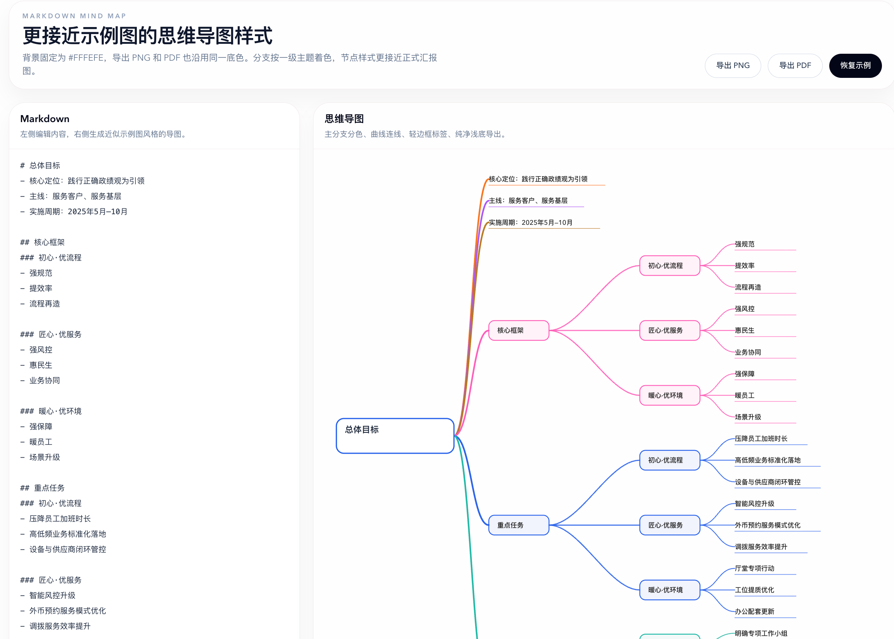

# Markdown Mind Map

English first. Chinese follows below.

## Overview

Markdown Mind Map is a Next.js application that turns Markdown text into a styled mind map in real time.

## Preview



The app provides:

- A left-side Markdown editor
- A right-side live mind map canvas
- A presentation-style visual theme inspired by business/report mind maps
- PNG export
- PDF export
- A clean export background in `#FFFEFE`

## Features

- Supports Markdown headings and lists
- Automatically builds hierarchical mind map branches
- Adjusts node width based on content length
- Uses colored top-level branches and curved connector lines
- Exports the current mind map as PNG or PDF

## Tech Stack

- Next.js 16
- React 19
- TypeScript
- Tailwind CSS 4

## Getting Started

Install dependencies:

```bash
npm install
```

Start the development server:

```bash
npm run dev
```

Open `http://localhost:3000` in your browser.

## Build

```bash
npm run build
```

## Lint

```bash
npm run lint
```

## Project Structure

```text
app/
  components/
    mindmap-workbench.tsx
  globals.css
  layout.tsx
  page.tsx
```

## Main Behavior

- Paste or edit Markdown in the left panel
- The right panel renders the mind map immediately
- Use the export buttons to download PNG or PDF output

## Notes

- The current parser is designed for headings and list-style outlines
- Exported PNG and PDF keep the same visual background as the canvas
- Layout and node sizing are calculated on the client side

---

# Markdown 思维导图

本项目是一个基于 Next.js 的 Markdown 思维导图应用，左侧输入 Markdown，右侧实时生成思维导图。

## 预览图


## 功能说明

- 左侧 Markdown 编辑区
- 右侧实时导图预览
- 更接近汇报场景的思维导图样式
- 支持导出 PNG
- 支持导出 PDF
- 导出背景统一为 `#FFFEFE`

## 支持内容

- Markdown 标题层级
- 无序列表
- 有序列表
- 根据内容长度自动调整节点宽度
- 一级分支彩色区分

## 本地运行

安装依赖：

```bash
npm install
```

启动开发环境：

```bash
npm run dev
```

浏览器打开 `http://localhost:3000`。

## 构建与检查

构建项目：

```bash
npm run build
```

代码检查：

```bash
npm run lint
```

## 主要文件

- [app/page.tsx](/Users/mac/Documents/project/github/mindmap/mindmap/app/page.tsx:1)
- [app/layout.tsx](/Users/mac/Documents/project/github/mindmap/mindmap/app/layout.tsx:1)
- [app/globals.css](/Users/mac/Documents/project/github/mindmap/mindmap/app/globals.css:1)
- [app/components/mindmap-workbench.tsx](/Users/mac/Documents/project/github/mindmap/mindmap/app/components/mindmap-workbench.tsx:1)
